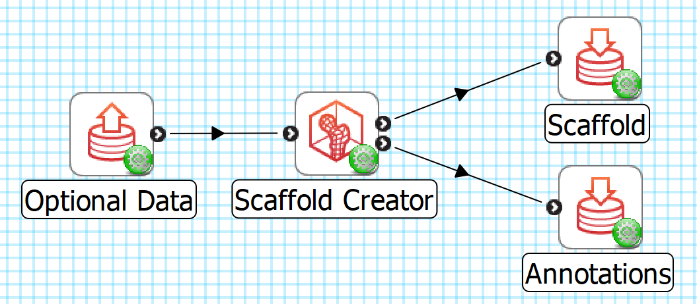
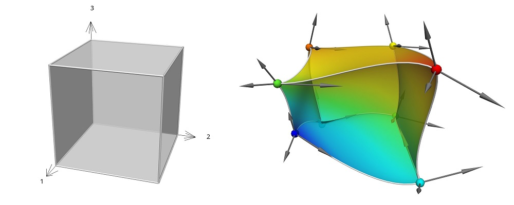
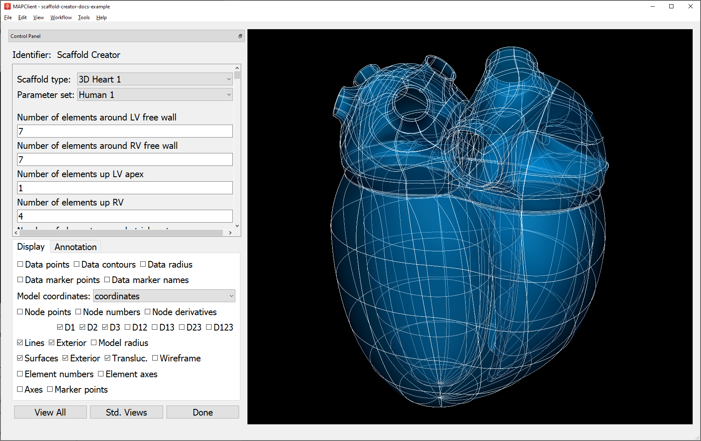
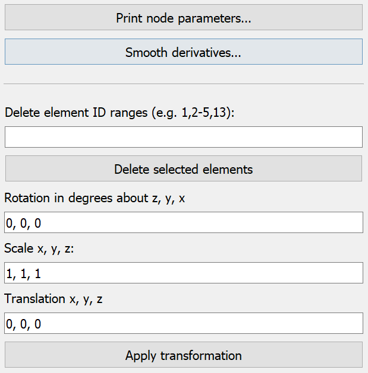
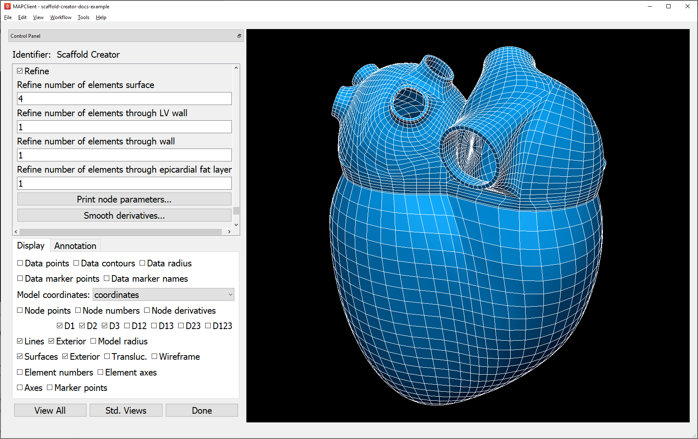
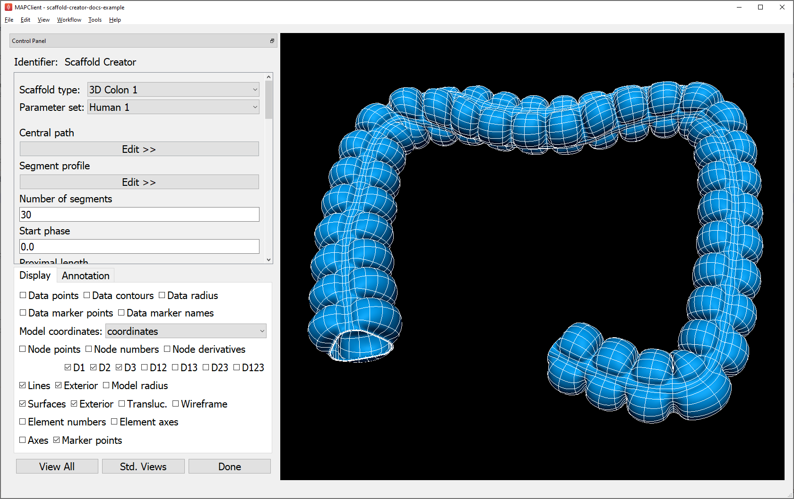
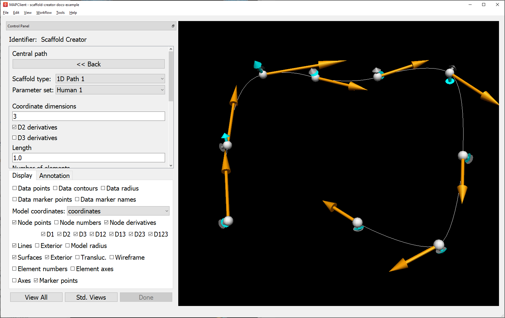

Scaffold Creator
================

Overview
--------

The **Scaffold Creator** tool provides a user interface for creating anatomical scaffolds: configurable geometric models of anatomy and other structures. This is one of the main types of *sources* for starting Mapping Tools workflows.

Models that can be created with this tool range from simple geometric shapes up to whole organ and body scaffolds which in addition to geometry may define:

* Multiple in-built parameter sets customized to different species or variants.
* Important anatomical regions and boundaries, including fiducial markers, annotated with standard anatomical terms from a controlled vocabulary to support automated fitting to data with the same annotations.
* Definitions of additional coordinate fields giving permanent material coordinates for embedding data and sub-models in the scaffold, or special configurations such as flat coordinates for fitting flat preparations of some or all of an organ.

Most users of **Scaffold Creator** will choose a scaffold type (organ) and parameter set (species), and be finished.

More advanced features include:

* Customising the scaffold by editing individual parameters of the scaffold scripts, which are usually anatomically significant measurements.
* Refining/resampling the scaffold to linear elements.
* Deleting parts of the scaffold to work with a subset of it, able to be merged back into the whole scaffold later.
* Adding custom annotations for user-specified surface and other regions, plus fiducial points.
* Transforming or directly editing scaffold coordinate field parameters. This is mainly done to edit *sub-scaffolds* such as the 1-D paths from which tubular or elongated models are generated.
* Running interactive functions for smoothing and listing parameters.

This document describes how to set up and use the **Scaffold Creator** user interface in the Mapping Tools. The actual work is done by the underlying *scaffoldmaker library* which consists of many scripts for procedurally generating the scaffolds from their parameters, which can run without a user interface, together with the *Zinc library* which handles model representation and calculations.

Workflow Connections
--------------------

The workflow connections for **Scaffold Creator** are shown in :numref:`fig-scaffold-creator-workflow`:

.. _fig-scaffold-creator-workflow:

   **Scaffold Creator** workflow connections.

The tool has 1 input on the left:

1. *Optional* data, a *Zinc library* compatible EX file, to visualize and customize the scaffold to, e.g. a converted `MBF XML file <https://neuromorphological-file-specification.readthedocs.io/en/latest/NMF.html>`_ output by the **MBFXML2EX Converter** tool, or **File Chooser** if read from a file.

It produces 2 outputs, which may be piped to other workflow steps:

1. The scaffold as a Zinc EX model file (top output);
2. A CSV file listing annotation terms and correspondings group names in the model (bottom output).

.. note::

   A current limitation of the MAP Client Mapping Tools environment is that workflow steps are only run if there is at least one connection in or out. Hence, the minimum workflow requires either input data or using a **File Location Sink** for one output. To make a new minimum workflow, click on File|New|Workflow, create and select a folder to contain it, drag the Scaffold Creator icon onto the workspace to make a workflow step, followed by a File Location Sink step, connect the top output of Scaffold Creator to the sink, click on the red configure icon for the sink and create and choose a folder inside the workflow folder, click OK and save.

Whether you use the output in a further workflow step or not, on completion of the workflow step the scaffold output is written to a file in the workflow folder under the same name as the step with extension ``.exf``, while the annotations are written to a similarly named file with ``_annotations.csv`` added to the name. At this time there can be two further hidden outputs, a VTK linear conversion of the model (step name + ``.vtk``) and markers (step name + ``_marker.csv``) listing coordinates and marker names. `Refinement`_ is usually needed to make the VTK model of reasonable quality.

Background
----------

Domains and Fields
^^^^^^^^^^^^^^^^^^

An *Anatomical Scaffold* is a mathematical description of an organ or other structure. It first defines of the "space" or collection of points making up the scaffold which is called its *Domain*. Here the Domain is constructed as a *Finite Element Mesh*, which is a collection of simple shapes (cubes, wedges, tetrahedra etc. in 3-D) called *Finite Elements* where "finite" refers to the bounded range of local coordinates in each element. *Material points* within a mesh are uniquely identified by an element and the local coordinates within it. Elements in the mesh may be connected or overlapping, meaning some material points in the Domain may be identifiable by multiple labels.

The Scaffold doesn't look like a real object until a *Coordinate Field* is defined over its Domain to give it its geometry. A field over a finite element mesh is defined by a collection of functions mapping the element and local coordinates to some values. A *Coordinate Field* is a special type of field which maps to coordinates in a coordinate system (e.g. x, y, z), with the special property of being an invertable 1:1 mapping (*bijection*) to all material points in the domain, and it also defines or reinforces the connectivity or continuity of the Domain. The scaffolds follow common practice of defining fields by storing parameters at *Nodes* -- shared points on element boundaries -- and these are interpolated over the elements with polynomial *basis functions*, ensuring the field is appropriately connected and continuous. This *divide and conquer* approach means the complex description of a whole organ is described by a piecewise set of simpler functions over the simply-shaped elements. The images showing scaffolds throughout the Mapping Tools documentation visualize a coordinate field, and the lines show the boundaries of the finite elements.

:numref:`fig-finite_element_cube_fields` shows a single finite element's domain coordinates, with geometric and non-geometric fields which could be defined as a function over it. 

.. _fig-finite_element_cube_fields:

   Unit cube finite element (left), with geometric and coloured non-geometric fields (right).

Scaffolds may be 3-D (made out of cube, wedge and tetrahedra elements, and collapsed cubes), 2-D (made of square and triangle elements) or 1-D (made of line elements).

All scaffolds include a *Parameter set* named ``Default`` which is usually the same as one of the other parameter sets provided, e.g. for a particular species.

All scaffolds created by the tool define a coordinate field named ``coordinates`` giving anatomically realistic geometry for the organ and species, and provide user-editable parameters for modifying it if needed. The **Geometry Fitter** tool can fit this field (i.e. its parameters) to data digitized for a specimen to give a fitted coordinate field, i.e. a specimen/patient specific geometric model. Several anatomical scaffolds define alternative coordinate fields for cut or flat configurations of part or all of the organ, usually named ``flat coordinates``, which can be fitted to a specimen-specific flat-mount dataset.

An increasing number of scaffolds also define a *Material Coordinate Field* which is `homeomorphic <https://en.wikipedia.org/wiki/Homeomorphism>`_ to the geometric ``coordinates`` but with an idealized shape. For example, topologically tubular organs such as the colon are defined with a material coordinate field that looks like a straight pipe of fixed diameter, wall thickness and length appropriately chosen to match the real aspect ratio; this is despite the real geometry being quite variable in diameter and thickness, with bends and other distortions along the length. The purpose of the material coordinate field is to provide a mesh-independent material coordinate space which is used for embedding (see **Data Embedder**). The field is not intended to be modified, meaning a location in material coordinates (coordinates within the range of this field) labels a unique material point. Material point locations in a mesh are found by inverting the material coordinate field, so any other field on the host scaffold can be evaluated at that location. This approach supports working with multiple meshes over the same domain, each mesh only needing its own material coordinates field covering the specified material coordinates range. The scaffolds here only define one mesh, and follow a convention of naming the material coordinates field with the organ or anatomical part followed by ``coordinates``, e.g. ``colon coordinates`` for the colon.

A common feature of most of the anatomical scaffolds in **Scaffold Creator** is that their geometry is defined with higher-order cubic Hermite functions, as shown in :numref:`fig-finite_element_cube_fields`, which share derivative parameters at nodes to give increased continuity between neighbouring elements. This gives the geometry a smooth representation, reflecting the real shapes of organs and other anatomy which have few sharp edges.

Anatomical Regions and Annotations
^^^^^^^^^^^^^^^^^^^^^^^^^^^^^^^^^^

What makes a scaffold more than just a simple mesh is the rich collection of annotated sub-regions defined with it. Anatomical regions of the scaffold are defined by *groups* of elements, their faces or edges/lines, which are named and identified with terms from a controlled vocabulary (particularly `UBERON <https://www.ebi.ac.uk/ols/ontologies/uberon>`_, plus other standands). Fiducial marker points are similarly defined as annotated embedded material points.

It is key to the whole anatomical mapping process that investigators digitizing their specimen images use the same anatomical terms to label contours or points for matching subregions, as shown in :numref:`fig-scaffold-data-annotation-groups`. 

.. _fig-scaffold-data-annotation-groups:

.. figure:: _images/scaffold-data-annotation-groups.png
   :figwidth: 80%
   :align: center

   Matching annotation groups by colour in rat heart scaffold (left) and data (right).

This consistent annotation of scaffolds and data allows automation of key parts of the mapping workflows including:

1. Fitting of specimen-specific geometric fields using **Geometry Fitter**;
2. Subsequent registration of data using **Data Embedder**;
3. Fitting of continuous fields to registered physiological data using **Field Fitter**.

Instructions
------------

Basics
^^^^^^

When **Scaffold Creator** is first run it creates the default ``3D Box 1`` scaffold. As shown in :numref:`fig-scaffold-creator-interface`, the first task is to choose the *Scaffold type* (here ``3D Heart 1``) and *Parameter set* (``Human 1``) at the top of the Control Panel.

.. _fig-scaffold-creator-interface:

   **Scaffold Creator** interface showing human heart scaffold.

Below the parameter set in the scroll area are all the user-editable parameters for the scaffold type, plus some common, advanced settings and function buttons shown in :numref:`fig-scaffold-creator-common-settings`, which are described in following sections.

.. _fig-scaffold-creator-common-settings:

   **Scaffold Creator** common, advanced scaffold settings.

Beyond choosing the scaffold type and parameter set, most other edits are typically only needed for advanced uses. However, users are encouraged to experiment with the controls as described in the remainder of this document.

Scaffold parameters may be:

* Integers e.g. 'Number of elements...' controlling mesh resolution in some direction;
* Real parameters for lengths, positions, diameters, radii, angles (degrees), or non-dimensional factors;
* Boolean flags controlling whether features are on or off;
* Lists of integers or reals;
* Sub-scaffolds forming part of a scaffold or used in its construction as described in `Sub-Scaffolds`_.

The controls for editing scaffold parameters are automatically generated for the scaffold parameters reported by the *scaffoldmaker library*, which also checks and restricts them to supported ranges of values.

Whenever parameters and settings are changed (including changing *Parameter set*), the whole scaffold is re-generated which may take some time, depending on the scaffold. If a change to one or more individual parameters is made, the changes are recorded in a ``Custom`` parameter set, and users can switch between it and any other parameter set until changes are made to a different base set of parameters. Be aware that any edited coordinate field parameters (see `Editing Field Parameters`_) are recorded in the Custom parameter set, but are lost when any single parameter is subsequently edited.

The settings in the *Display* tab can be changed at any time to turn on or off graphics as for several other mapping tools. The Data-specific display settings are only shown if there is input data. If the scaffold generates multiple coordinate fields (such as material coordinates and flat coordinates), these can be switched with the *Model coordinates* field chooser.

Rotating, panning and zooming the view is done by holding down a mouse button and dragging as in the following table:

======================= ==============
Mouse Button            Transformation
======================= ==============
Left                    Tumble/Rotate
----------------------- --------------
Middle or Shift+Left    Pan/Translate
----------------------- --------------
Right or Ctrl+Left(Mac) Fly Zoom
----------------------- --------------
Shift+Right             Camera Zoom
======================= ==============

The *View All* button conservatively resets the view to see the whole model (esp. if coordinate field is changed), while *Std. Views* cycles between standard orthographic views of the graphics.

Click *Done* to accept the current scaffold and progress to the next workflow step. Note that **Scaffold Creator** saves all the settings and edits (but not the current selection or view) in a local file which is loaded when it is next run. The settings file is called step name + ``-settings.json``; it's sometimes useful to back this up.

Annotations
^^^^^^^^^^^

In the *Annotation* tab, shown in :numref:`fig-scaffold-creator-annotation`, you can view annotated regions and points in the scaffold by selecting them in the *Group* chooser.

.. _fig-scaffold-creator-annotation:

.. figure:: _images/scaffold-creator-annotation.png
   :align: center

   **Scaffold Creator** highlighting heart ``left ventricle myocardium`` annotation group.

The annotations are assigned to a group of objects in the model: nodes, lines, surfaces, elements. Fiducial marker point groups only contain one node with an embedded location.

You must be displaying appropriate graphics to see the highlighted annotation groups, i.e. *Marker points* for fiducial marker points with labels; *Node points*, *Lines*, *Surfaces* for 0-D, 1-D, 2-D features and *Element numbers* or *Element axes* for the highest dimension features. Use *Translucent* or *Wireframe* surfaces to see interior features, with *Exterior* lines/surfaces off as needed.

A nice trick is to hover over the *Group* chooser and rotate the mouse wheel, which quickly cycles between highlighted groups. The *Group* lists the name assigned to the region, while the *ONT:ID* setting shows the standard anatomical term identifier assigned to the group. When a marker point group is selected, its element number and local element domain coordinates are displayed, and if it has material coordinates the field and coordinate values are displayed.

To create a user annotation group requires first selecting the graphics for objects of the required dimension (listed above). It's best to start with no annotation group selected unless you intend to make a group which includes its objects. Selection is done by holding the *'S'* key and clicking on graphics for an object of the required dimension as listed above. Hold down *shift-'S'* to add to the selection, or toggle a single item. Box selection is also possible by dragging the mouse, provided the initial click is away from any objects. Selecting a blank area of the screen clears the selection.

Be careful when doing selection that you have first clicked in the window to give it focus, otherwise the character *'s'* could be entered as a parameter or part of the group name!

By clicking *New* a new user-defined annotation group is created, and will contain the highest dimension selected objects, plus their lower dimensional faces, lines and nodes only. Its initial name will be ``group1`` or similar, with *ONT:ID* ``None``, both of which can be edited. The group can be redefined from another selection using the *Redefine* button, or deleted with the *Delete* button.

By clicking *New Marker* you can create a special marker annotation group for which you can enter an element number and element domain "xi" coordinates, or choose a *Material coordinates field* and supply the *Material coordinates* x, y, z location. Custom markers are one way to mark material locations where a specimen was taken from a larger scaffold.

Note that a scaffold's built-in annotation groups cannot be edited or destroyed.

Refinement
^^^^^^^^^^

Many scaffolds support resampling and refinement of the mesh into linear elements, performed by selecting the 'Refine' option with appropriate 'Refine number of elements...' parameters controlling regular subdivision of the elements of the original scaffold, as in :numref:`fig-scaffold-creator-refinement`.

.. _fig-scaffold-creator-refinement:

   **Scaffold Creator** showing refined human heart scaffold.

Refinement is currently limited in functionality. It can only define the ``coordinates`` geometric field on the refined mesh, and only supports 3D cube (hexahedral) elements. For some scaffolds such as the heart shown above, parts of the refined mesh are not fully conformant for all combinations of 'Refine number of elements...' parameters (which is easily visualized by viewing *Exterior* lines or surfaces with *Translucent* surfaces). Eventual plans are to remove these limitations, and to support more than just linear bases on the refined/resampled mesh. Note that annotation groups and marker points *are* transferred to the refined scaffold.

Sub-Scaffolds
^^^^^^^^^^^^^

A Scaffold may have one or more *Sub-Scaffolds* as parameters, which can be used to:

1. Define geometry for construction of the scaffold;
2. Define a sub-assembly in the scaffold;
3. Define the form of a repeated unit in the scaffold.

Change the *Scaffold Type* to ``3D Colon 1`` with *Parameter set* ``Human 1`` (same as ``Default``), wait for it to be generated (a few seconds), click *View All* and zoom to see it. As shown in :numref:`fig-scaffold-creator-colon`, the colon scaffold has sub-scaffolds from the above categories 1 and 3 as its first two parameters. (The pulmonary vein inlets on the left atrium of the heart shown earlier in this document are examples of a sub-assembly, however these are adapted to conform to the left atrium surface.)

.. _fig-scaffold-creator-colon:

   **Scaffold Creator** showing human colon scaffold with sub-scaffold parameters.

The *Segment profile* defines the shape of repeating units along the colon, defining the number of longitudinal muscle bands (*tenia coli*) and the shape of the characteristic bulges (*haustra*) for human and other species.

The *Central path* is a ``1D Path 1`` scaffold with custom parameter sets defined from the parent ``3D Colon 1``, which define the central path curve for different species. Click on *Edit >>* below *Central path* to edit the sub-scaffold, which brings up the display shown in :numref:`fig-scaffold-creator-colon-central-path` (noting you'll need to turn off *Exterior* for lines, and show *Node points* and all *Node derivatives*).

.. _fig-scaffold-creator-colon-central-path:

   **Scaffold Creator** showing the human colon central path sub-scaffold.

Parameters for the sub-scaffold can be edited here, but beware that any custom coordinate field parameters will be lost if values are changed. For these central paths, the user is more likely to edit field parameters i.e. node positions and derivatives controlling the path as described in the following section, and run `Interactive Functions`_ to modify the parameters. *Scaffold type* ``1D Path 1`` offers several interactive functions for smoothing the derivatives along the curve, making side axes normal to the curve and smoothing the side cross derivatives (which control the directions and twist of the tenia coli in the colon scaffold).

Click *<< Back* to regenerate and see the parent scaffold.

Editing Field Parameters
^^^^^^^^^^^^^^^^^^^^^^^^

When *Node points* or *Node numbers* are displayed as in :numref:`fig-scaffold-creator-colon-central-path`, the user can select and move them by holding down the *'S'* key, clicking on the point with the left mouse button and dragging the mouse with the button held down. The selected node point is highlighted. Be careful to click in the graphics window so it has focus before doing this, or 's' could be entered elsewhere. If *Node derivatives* are displayed, their directions and magnitudes can also be edited by dragging the tips of the arrows. The *Node derivatives* control is tri-state: the first click only shows derivatives on selected nodes, fully checking it shows derivatives on all nodes. Node edits are always made in the plane normal to the view direction; cycle through the *Std. views* to restrict editing to x-y, x-z and y-z planes.

The set of edited nodes and their modified ``coordinates`` field parameters are stored in the **Scaffold Creator** step's settings file, and re-applied next time it is run.

A known issue is that node selection and editing may not work on some graphics cards. Enabling rendering on a discrete NVIDIA graphics card (a per-application setting in the NVIDIA Control Panel) has been found to work reliably.

Deleting Elements
^^^^^^^^^^^^^^^^^

Elements in the scaffold can be deleted by entering ranges in the *Delete element ID ranges* edit box shown in :numref:`fig-scaffold-creator-common-settings`; identifiers can be shown by checking *Element numbers* in the *Display* tab. Alternatively, elements can be selected in the graphics window (either by highlighting an annotation group or selecting with the *'S'* key, including box select) as long as there are graphics displayed for the appropriate dimension objects: *Element numbers* or *Element axes* for the highest dimension, surfaces for 2-D and lines for 1-D. Clicking *Delete selected elements* deletes the selected elements of the highest dimension, adding to the deletion list.

Deletion of elements happens after the whole scaffold is created which means the elements, faces, lines and nodes all maintain their same form and identifiers from the full scaffold, and can therefore be merged back into it later.

Be aware that the list of deleted elements is not cleared when the scaffold or parameters are changed -- the user needs to clear it. Also, the range of elements is for the final mesh (refined or not); it isn't yet possible to delete elements on the unrefined mesh and only refine those that are left.

Transformation
^^^^^^^^^^^^^^

In the advanced controls shown in :numref:`fig-scaffold-creator-common-settings`, are settings controlling the global *Rotation*, *Scale* and *Translation* which transform all the coordinates of the scaffold. The scaffold model file output by **Scaffold Creator** will have these transformations applied to all coordinates.

The transformations can also be interactively changed, which is helpful for aligning the scaffold with any input data. Interactive alignment is done by holding down the *'A'* key and dragging with the left, middle or right mouse buttons which have a similar effect to the viewing rotate, pan and zoom controls. Similar to selection, it's important to have clicked in the graphics area to give it focus before pressing the *'A'* key.

Clicking the *Apply transformation* button applies the transformation to the coordinate field parameters and clears the transformation parameters. Edited parameters for all nodes are stored with the step settings.

The transformation is reset when the *Scaffold type* or *Parameter set* is changed.

Interactive Functions
^^^^^^^^^^^^^^^^^^^^^

As shown in :numref:`fig-scaffold-creator-common-settings`, all scaffolds present the following Interactive Function buttons:

* *Print node parameters...* which prints parameters in the console as python format sequences with the specified C-style number format, for all selected nodes, or all nodes if none are selected.
* *Smooth derivatives...* adjusts magnitudes and optionally also directions of derivatives to be 'smooth' across the mesh for selected nodes, or all nodes if none are selected. This makes them of appropriate magnitude for the element sizes. The user can select either arithmetic or harmonic mean of all arc lengths the derivative is along; harmonic is preferred where there are significant changes in neighbouring element sizes (more than 1.5:1), otherwise arithmetic is best.

Any scaffold scripts may supply custom Interactive Functions with options. The **Scaffold Creator** queries and adds buttons for these in its interface. Only the ``1D Path 1`` scaffold currently offers these, to control direction and smoothness of side axes along the path.

These functions are mainly useful for scaffold developers needing to create good parameters for sub-scaffolds such as the colon central paths for different species, with the printed parameters ready to be pasted into a python script.